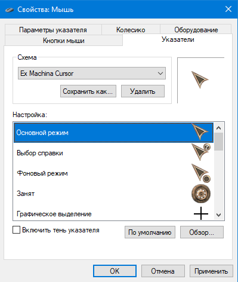

# HTACursor

  

## 🇷🇺 Курсор мыши Windows под стиль Ex Machina:
1. Скачайте курсоры `.cur` и `.ani` из папки репозитория `HTA cursors` в удобную для вас папку на компьютере;
2. Нажмите правой кнопкой мыши по пустому рабочему столу, выберите `Персонализация` (или любым другим способом);
3. Выберите `Темы`, а затем `Курсор мыши` (или любым другим способом откройте окно настроек указателя мыши);
4. Поменяйте нужную настройку указателя, нажав `Обзор...`. В открывшемся проводнике выберите один из ранее скачанных курсоров;
5. Повторите со всеми доступными курсорами;
6. Сохраните измененную схему указателя через `Сохранить как...`. Назовите любым понятным именем;
7. Нажмите `Применить`.

## 🇬🇧 Windows mouse cursor style from Hard Truck Apocalypse:
1. Download the `.cur` and `.ani` cursors from the `HTA cursors` repository folder to a folder on your computer that is convenient for you;
2. Right-click on the empty desktop, select `Personalization` (or any other way);
3. Select `Themes` and then `Mouse Cursor' (or open the mouse pointer settings window in any other way);
4. Change the desired pointer setting by clicking `Browse...`. In the explorer that opens, select one of the previously downloaded cursors;
5. Repeat with all available cursors;
6. Save the modified pointer schema via `Save as...`. Name it by any understandable name.;
7. Click `Apply`.

